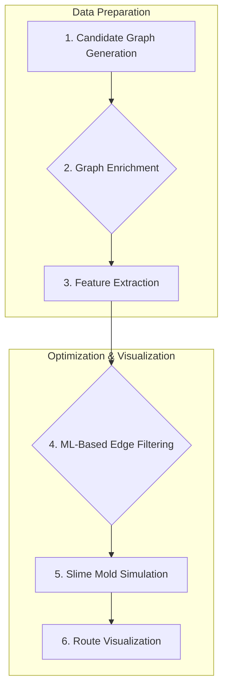

<div align="center">
  
  <h1>PhysarumRail</h1>
  <p>
    <strong>A bio-inspired AI system for dynamic and efficient urban railway routing.</strong>
  </p>
  <p>
    <a href="https://www.python.org/downloads/release/python-390/"></a>
    <a href="https://github.com/mazelini/PhasyrumRail/blob/main/LICENSE"></a>
  </p>
</div>

---

##  Overview

**PhysarumRail** is an innovative, bio-inspired AI system that fuses slime-mold–inspired reinforcement, LightGBM-based filtering, and enriched geospatial data to dynamically generate efficient urban railway routes. The system is accessible via an interactive Streamlit interface, allowing for intuitive and powerful railway network optimization.

##  Features

-   **Bio-Inspired Optimization**: Utilizes a slime mold simulation algorithm (`Physarum polycephalum`) for novel and efficient pathfinding.
-   **Machine Learning Integration**: A LightGBM model filters and prioritizes potential railway paths based on geographic and demographic features.
-   **Rich Geospatial Analysis**: Enriches network graphs with data like elevation, population density, and existing infrastructure.
-   **Interactive UI**: A Streamlit-based web application for easy interaction, visualization, and configuration.
-   **Modular & Extensible**: Designed with a clear project structure to facilitate extension and further research.

##  How It Works

The system follows a multi-stage process to generate and refine railway networks:



1.  **Candidate Graph Generation**: Creates a foundational grid graph over the selected geographical area.
2.  **Graph Enrichment**: Augments the graph with geospatial data, including elevation, slope, and population density.
3.  **Feature Extraction**: Calculates features for each potential edge in the graph.
4.  **ML-Based Edge Filtering**: A pre-trained LightGBM model predicts the viability of each edge, pruning unpromising paths.
5.  **Slime Mold Simulation**: The bio-inspired algorithm explores the filtered graph to find the most efficient and robust routes between the origin and destination.
6.  **Route Visualization**: The final optimized routes are presented on an interactive map.

##  Tech Stack

-   **Backend**: Python
-   **ML/Data Science**: LightGBM, Scikit-learn, GeoPandas, NumPy, NetworkX
-   **Simulation**: Custom implementation based on the research of Tero et al.
-   **Web Framework**: Streamlit
-   **Geospatial**: GDAL, Rasterio, OSMnx

##  Getting Started

### Prerequisites

-   Python 3.9 or later
-   [GDAL](https://gdal.org/download.html) installed on your system.

### Installation

1.  **Clone the repository:**
    ```bash
    git clone https://github.com/mazelini/PhasyrumRail.git
    cd PhasyrumRail
    ```

2.  **Create and activate a virtual environment:**
    ```bash
    python -m venv venv
    source venv/bin/activate  # On Windows, use `venv\Scripts\activate`
    ```

3.  **Install the dependencies:**
    ```bash
    pip install -r requirements.txt
    ```

### Running the Application

1.  **Launch the Streamlit app:**
    ```bash
    streamlit run app.py
    ```

2.  Open your web browser and navigate to `http://localhost:8501`.

##  Project Structure

```
PhasyrumRail/
├── app.py                      # Main Streamlit web application
├── train_model.py              # Script for training the LightGBM model
├── extract_features_for_training.py # Extracts features for model training
├── requirements.txt            # Project dependencies
├── .gitignore                  # Files to be ignored by Git
├── README.md                   # Project README file
├── LICENSE                     # Project License
├── sim/                        # Slime mold simulation module
│   └── slime_simulator.py
├── utils/                      # Utility functions for graph processing, etc.
│   ├── build_candidate_graph.py
│   ├── enrich_graph.py
│   ├── graph_features.py
│   └── map_export.py
└── assets/                     # Logos and other assets
    └── logo.png
```

